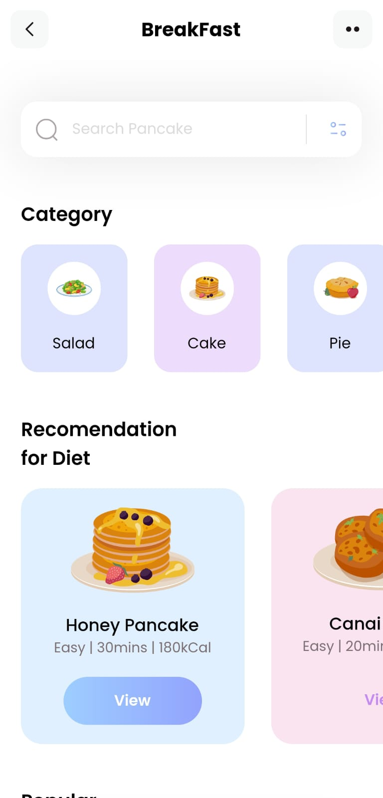

# First Flutter App

I embarked on this Flutter app development journey as a beginner, eager to transform my ideas into a tangible,
user-friendly product. Throughout the process, I honed my coding skills, learned about UI/UX design, and
discovered the limitless potential of Flutter for creating stunning cross-platform apps.

## ScreenShots

